# Booking app

This is an Airbnb-like project that utilizes the MERN stack to replicate some of the functionality of [Airbnb](https://www.airbnb.com).

It utilizes React and Tailwind CSS on the frontend to create the components that power the app. On the backend, it uses Express.js to set up the routes and Mongoose to connect to a MongoDB database in the cloud and manage the app's data.

Some of functionality includes:
- Registering users
- Login user
- Auto login via cookies
- Users can publicate places for other users to book
- Booking of existing places
- Visualization of places and bookings data
- Server-side data validation
- Navigation using react-router-dom

## Images

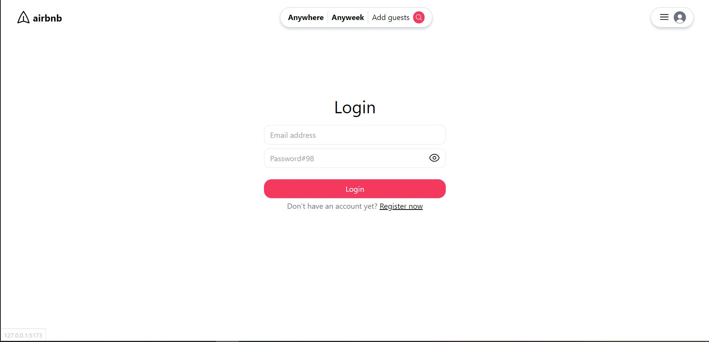
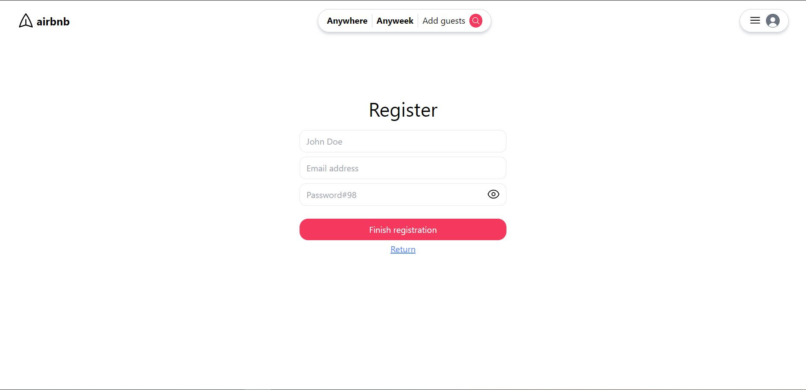
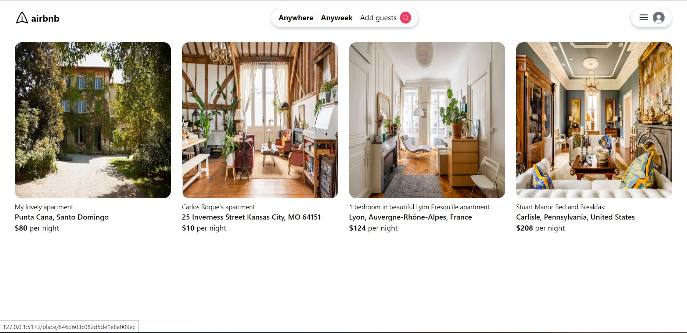
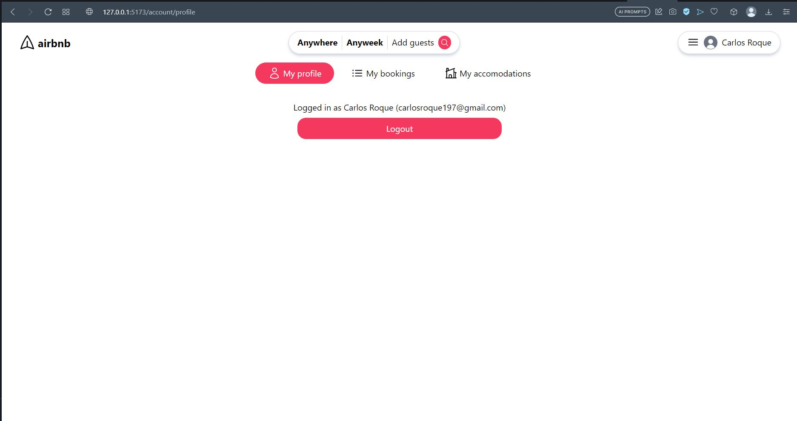
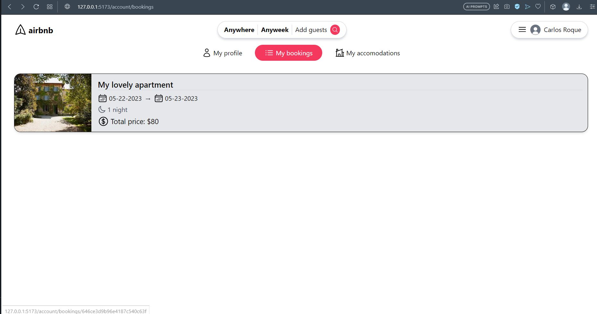
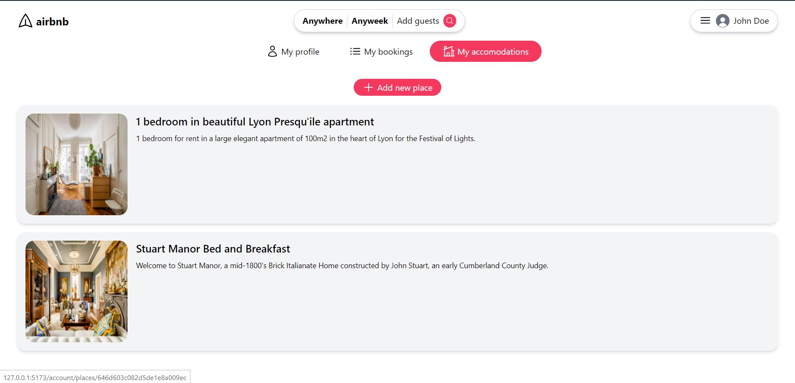
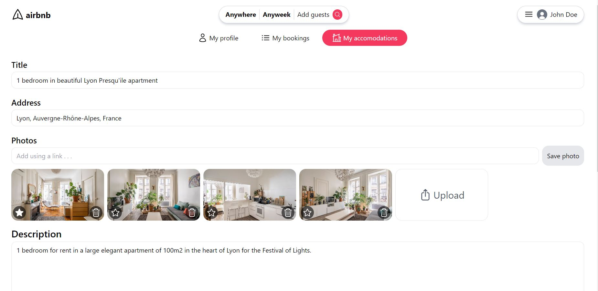
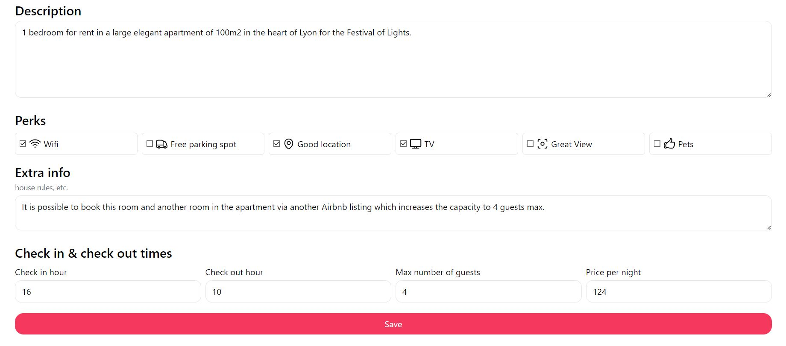
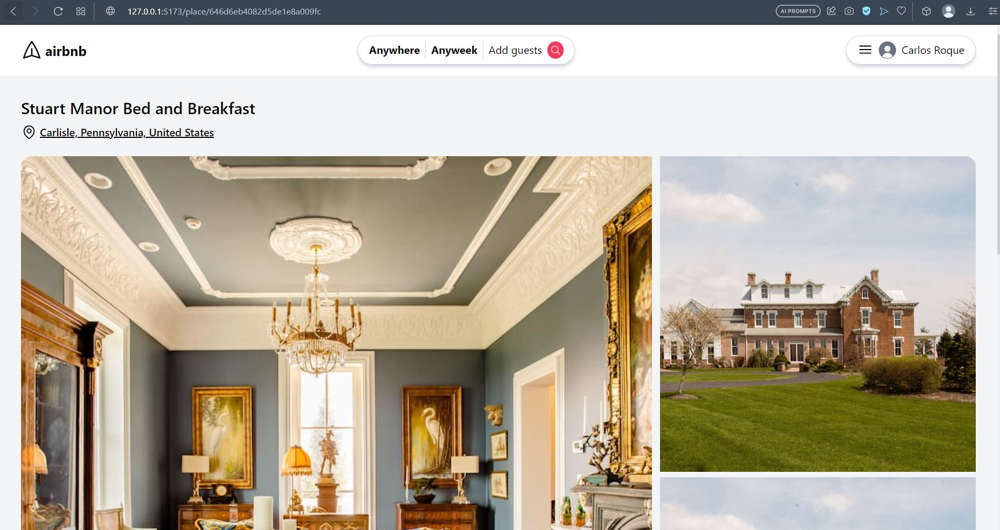
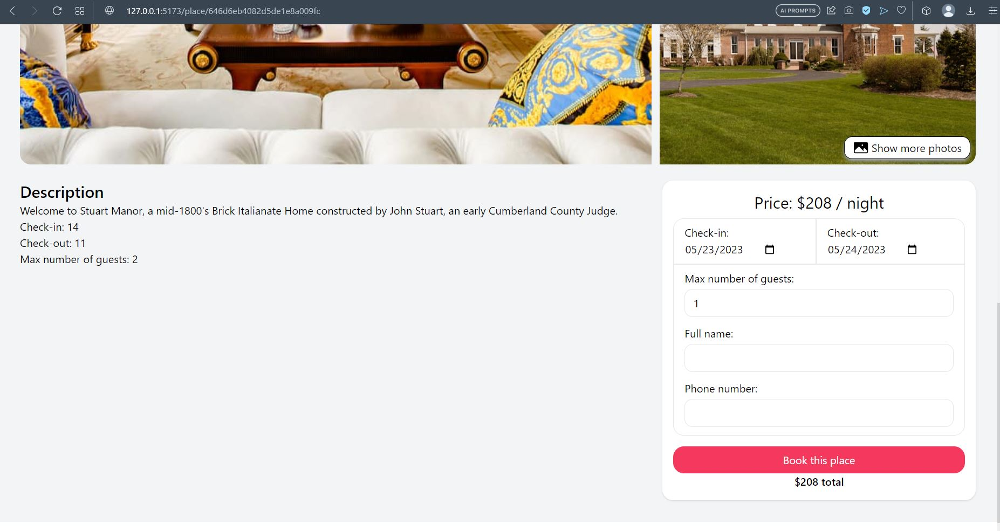
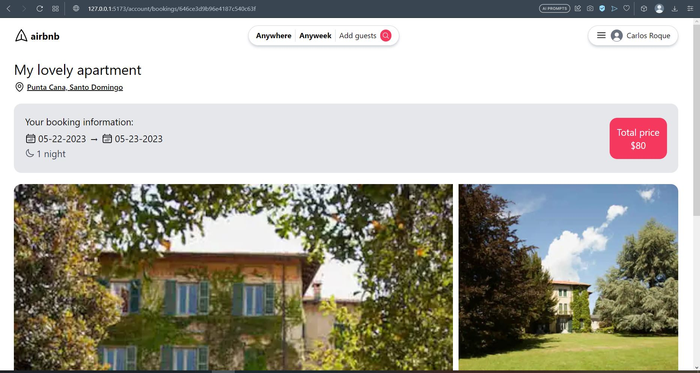